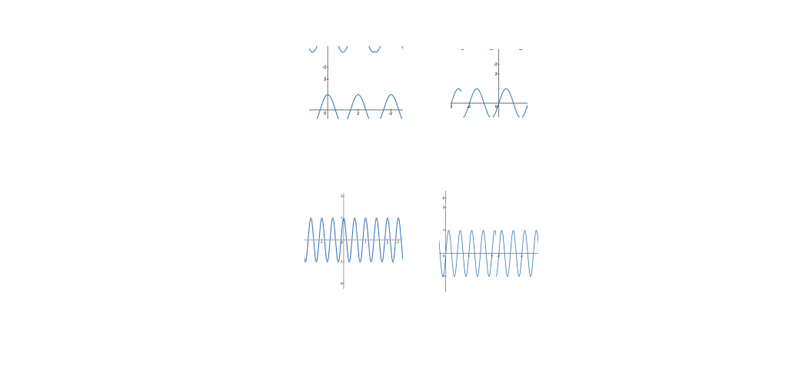
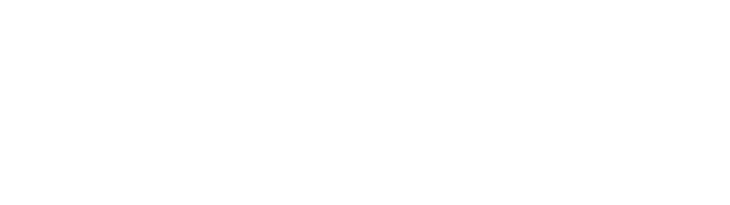
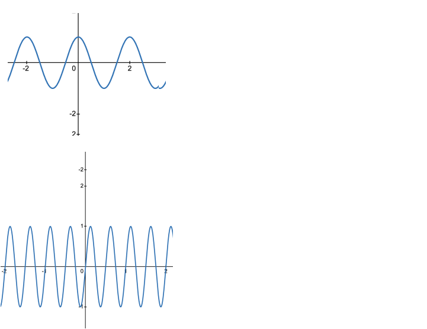
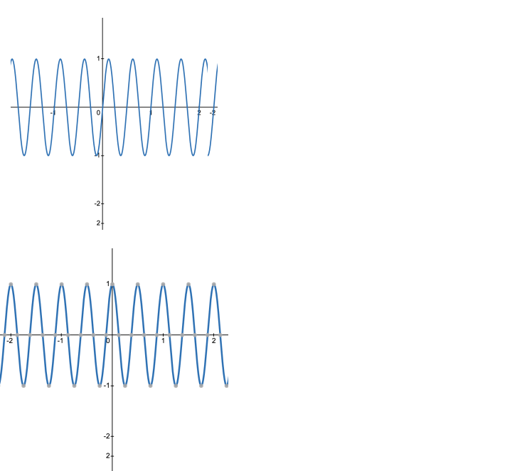
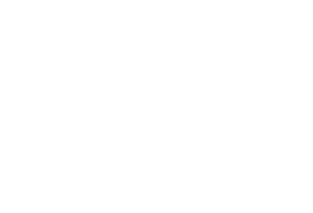

# Fourier Transforms

The Fourier transform explains how a signal in one domain (time) can be transformed into another domain (frequency), and viceversa.  

!!! note "The **transform equation** expresses a time-domain function $x(t)$ in terms of a frequency-domain function $X(\omega)$."
    $$
    \Large x(t)=\frac{1}{2 \pi} \int_{-\infty}^{\infty} X(j \omega) e^{j \omega t} d \tau$ 
    $$

A time-domain function can be represented as a combination of waveforms. Each waveforms has a real and an imaginary component:
  
  - Real component: \( \cos(\omega t) \).
  - Imaginary component: \( \sin(\omega t) \).

These **waveforms are the building blocks for the transformation** and they are referred as **basis functions**. With the Euler's formula we obtain:

$$
\Large x(t)=\frac{1}{2 \pi} \int_{-\infty}^{\infty} X(j \omega) [(\cos (\omega t)+j \sin (\omega t)] d \tau
$$

The formula indicates that we consider all the frequencies from $-\infty$ to $\infty$. Each function $X(j\omega)$ at a specific 
frequency (e.g., $\omega_1$, $\omega_2$, etc.) **weights the basis functions** $\cos (\omega t)$
and  $\sin (\omega t)$.

&nbsp;&nbsp;&nbsp; 
&nbsp;&nbsp;&nbsp; 

&nbsp;&nbsp;&nbsp; 
&nbsp;&nbsp;&nbsp; 

This means that any time-domain signal  $x(t)$  that has finite energy can be written as a summation of the basis functions  $\cos(\omega t)$  and  $\sin(\omega t)$  at all frequencies (from  $-\infty$  to  $\infty$ ), each multiplied by a factor  $X(j\omega)$. 

&nbsp;&nbsp;&nbsp; 
&nbsp;&nbsp;&nbsp; 

$x(t)$ and $X(jw)$ are equivant representations of the same signal, and any signal $x(t)$ can be made up of sinusoidal components. 

## More Considerations 

Let’s consider, for example, a voice signal $x(t)$, which has low-pass characteristics, meaning that I can only produce the sound of my voice at certain frequencies below $\omega$.

Let's have a cosine wave at different frequencies $\cos \left(2 \pi f_1 t\right)$ and $\cos \left(2 \pi f_2 t\right)$. In the frequency domain, **each wave can have only a single frequency component**, represented as a delta function (with the matching negative component).

If we have an infinite number of wave functions each using a different frequency, all the delta functions appearing in the frequency domain (infinitely close together, forming a continuous signal in the frequency domain) will define the original signal in the time domain when summed up with the right weights.

To understand why we have negative components in the frequency domain, we can take a sine wave at the same frequency $f_2$ as the previous cosine wave. They have the same frequency but a **different phase.**

The signal $w(t) = \sin \left(2 \pi f_2 t\right)$ can be written as a complex number by relying on the Euler's formula $e^{j \theta}=\cos (\theta)+j \sin (\theta)$ and its counterpart $e^{-j \theta}=\cos (\theta)-j \sin (\theta)$:

Add and subtract the equations :

- $e^{j \theta}+e^{-j \theta}=2 \cos (\theta)$ $\rightarrow$ $\cos (\theta)=\frac{e^{j \theta}+e^{-j \theta}}{2}$
- $e^{j \theta}-e^{-j \theta}=2 j \sin (\theta)$ $\rightarrow$
$\sin (\theta)=\frac{e^{j \theta}-e^{-j \theta}}{2 j}$

Now, use the formulas for $sin(\theta)$ to rewrite $w(t) = \sin \left(2 \pi f_2 t\right)$:

- Substitute $\theta=2 \pi f_2 t$ into the formula for $\sin (\theta)$ :
      - $\sin \left(2 \pi f_2 t\right)=\frac{e^{j 2 \pi f_2 t}-e^{-j 2 \pi f_2 t}}{2 j}$

- Replace $\sin \left(2 \pi f_2 t\right)$ with $w(t)$, as defined in the problem:
      - $w(t)=\frac{1}{2 j}\left(e^{j 2 \pi f_2 t}-e^{-j 2 \pi f_2 t}\right)$

Interpret the terms:

$$
\huge w(t)=\frac{1}{2 j}\left(e^{j 2 \pi f_2 t} - e^{-j 2 \pi f_2 t}\right)
$$

- $\frac{1}{2 j}$ coefficient
- $e^{j 2 \pi f_2 t}$ represents the complex exponential at a positive frequency  $f_2$.
- $e^{-j 2 \pi f_2 t}$ represents the complex exponential at a negative frequency  $-f_2$.

So far, we have plotted only the magnitude of the signals in the frequency domain. However, since we are manipulating complex numbers, **we also need to plot the phase**.

Let’s rearrange the formula above and derive the polar coordinates:

- Simplify the coefficient $\frac{1}{2 j}$, by using the property $\frac{1}{j}=-j$, rewrite:
     - $\frac{1}{2 j}=-\frac{1}{2} j$

-  In the complex plane, $-j$ corresponds to a phase of $-\frac{\pi}{2}$. 
     - Using the polar form: $-j=e^{-j_2\frac{\pi}{2}}$
     - Substitute this into $-\frac{1}{2} j=\frac{1}{2} e^{-j \frac{\pi}{2}}$

- Combining these results, we have:

$$
\huge \frac{1}{2 j}=-\frac{1}{2} j=\frac{1}{2} e^{-j \frac{\pi}{2}}
$$

$$
\huge w(t)=-\frac{1}{2}j\left(e^{j 2 \pi f_2 t} - e^{-j 2 \pi f_2 t}\right)
$$

$$
\huge= -\frac{1}{2}je^{j 2 \pi f_2 t}+\frac{1}{2}je^{-j 2 \pi f_2 t}
$$

- The positive frequency $e^{j 2 \pi f_2 t}$ rotates $90^{\circ}$ counterclockwise in the complex plane, and the coefficient introduces a phase of $-\frac{\pi}{2}$.
- The negative frequency $e^{-j 2 \pi f_2 t}$ rotates $90^{\circ}$ clockwise in the complex plane, and the coefficient introduces a phase of $\frac{\pi}{2}$.

This is why the positive frequency has a phase of $-\frac{\pi}{2}$ and the negative frequency has a phase of $\frac{\pi}{2}$. Together, they ensure the correct representation of the real-valued sine wave.

To summarize, at each frequency, there exist two different signals that are orthogonal: cosine and sine. Therefore, we need two components in the frequency domain, and this is one of the main reasons for using complex numbers.

**Check the case for the cosine**

[Video link What is Negative Frequency?](https://youtu.be/gz6AKW-R69s?si=itBxrd45HZpqiqwg)

<h2 id="transform-rectangular-pulse-signal">Transformation of Rectangular Pulse Signal</h2>

## Proof of Fourier Transform of a Rectangular Pulse Signal

!!! note "Transform of a Rectangular Pulse Signal"
    

    $\Large \Pi\left(\frac{t}{T}\right) \equiv 
    \begin{cases} 
    1 & \text{if } |t| \leq \frac{T}{2} \\ 
    0 & \text{if } |t| > \frac{T}{2}
    \end{cases}$
    

 
    

    {width=300px height=200px}
    

  
    

    $\Large \mathcal{F(A\Pi\left(\frac{t}{T}\right))}=A T \frac{\sin \left(2 \pi f \frac{T}{2}\right)}{2 \pi f \frac{T}{2}}=A T \cdot \operatorname{sinc}(f T)$
    

We want to compute the Fourier Transform of the rectangular pulse signal:

$$
A \Pi\left(\frac{t}{T}\right)
$$

where $\Pi(x)$ is the rectangular function defined as:

$$
\Pi(x) =
\begin{cases}
1 & \text{if } |x| \leq \frac{1}{2}, \\
0 & \text{otherwise.}
\end{cases}
$$

The goal is to prove:

$$
\mathcal{F} \left[ A \Pi\left(\frac{t}{T}\right) \right] = AT \cdot \text{sinc}(fT)
$$

---

### 1. Fourier Transform Definition

The Fourier Transform of a time-domain signal $x(t)$ is defined as:

$$
\mathcal{F}[x(t)] = X(f) = \int_{-\infty}^\infty x(t) e^{-j 2\pi f t} dt
$$

For $A \Pi\left(\frac{t}{T}\right)$, the function is nonzero only for $|t| \leq \frac{T}{2}$. Thus, the limits of integration are restricted to $t \in \left[-\frac{T}{2}, \frac{T}{2}\right]$, and the Fourier Transform becomes:

$$
X(f) = \int_{-\frac{T}{2}}^{\frac{T}{2}} A e^{-j 2\pi f t} dt
$$

---

### 2. Solve the Integral

Factor out the constant $A$:

$$
X(f) = A \int_{-\frac{T}{2}}^{\frac{T}{2}} e^{-j 2\pi f t} dt
$$

This is a standard integral of the exponential function. The solution of this integral is:

$$
\int e^{-j 2\pi f t} dt = \frac{e^{-j 2\pi f t}}{-j 2\pi f}
$$

Now evaluate this over the limits $t = -\frac{T}{2}$ and $t = \frac{T}{2}$:

$$
X(f) = A \left[ \frac{e^{-j 2\pi f \frac{T}{2}} - e^{j 2\pi f \frac{T}{2}}}{-j 2\pi f} \right]
$$

---

### 3. Simplify the Expression

Combine the exponentials using Euler's formula:

$$
e^{-j\theta} - e^{j\theta} = -2j \sin(\theta)
$$

Here, $\theta = \pi f T$. Substituting this into the expression:

$$
X(f) = A \cdot \frac{-2j \sin(\pi f T)}{-j 2\pi f}
$$

Cancel out the $-j$ terms and simplify:

$$
X(f) = A \cdot \frac{\sin(\pi f T)}{\pi f}
$$

---

### 4. Recognize the Sinc Function

The normalized sinc function is defined as:

$$
\text{sinc}(x) = \frac{\sin(\pi x)}{\pi x}
$$

Substitute $x = fT$ into the definition:

$$
X(f) = A T \cdot \text{sinc}(fT)
$$

---

### Final Result

Thus, the Fourier Transform of $A \Pi\left(\frac{t}{T}\right)$ is:

$$
\mathcal{F} \left[ A \Pi\left(\frac{t}{T}\right) \right] = AT \cdot \text{sinc}(fT)
$$

## The Fourier transform of a periodic function in time results in a Dirac comb in the frequency domain.

!!! note "Dirac delta function"
    

    $\Large \delta\left(t-t_0\right)$ (i.e., impulse in $t=t_0$)
    

!!! note " Train of Dirac delta functions (i.e., train of impulses)"
    

    $\Large \sum_{k=-\infty}^{k=\infty} \delta(t-k T)$
    

!!! note "Transform of a train of Dirac delta functions (i.e., train of impulses)"
    

    $\Large \mathcal{F}\left\{\delta\left(t-T\right)\right\}=e^{-j 2 \pi f T}$
    

   
    - The Fourier Transform of a train of impulses in time produces another train in the frequency domain.
    
    - The exponential term represents a phase shift in the frequency domain.

!!! note "Transform of a train of impulses (i.e., Dirac delta functions)"
  
    Apply Fourier transform 

    $\huge \mathcal{F}\left(\sum_{k=-\infty}^{\infty} \delta(t-k T)\right)=\int_{-\infty}^{\infty} \left(\sum_{k=-\infty}^{\infty} \delta(t-k T)\right) e^{-j 2 \pi f t} \, dt$

    Using the linearity of integration and summation, we can interchange the order:

    $\huge X(f) = \sum_{k=-\infty}^{\infty} \int_{-\infty}^{\infty} \delta(t-k T) e^{-j 2 \pi f t} \, dt$

    The sifting property of the Dirac delta function $\int_{-\infty}^{\infty} f(t) \delta\left(t-t_0\right) d t=f\left(t_0\right)$ gives:

    $\huge \int_{-\infty}^{\infty} e^{-j 2 \pi f t}  \delta(t-k T) d t=e^{-j 2 \pi f k T}$

    So:

    $\huge X(f)=\sum_{k=-\infty}^{\infty} e^{-j 2 \pi f k T}$

    Recal Euler's formula

    $\huge e^{-j \theta}=\cos (\theta)-j \sin (\theta)$

    So, for each term in the summation: 

    $\huge e^{-j 2 \pi f k T}=\cos (2 \pi f k T)-j \sin (2 \pi f k T)$
 
    The summation can now be rewritten as:

    $\huge \sum_{k=-\infty}^{\infty} e^{-j 2 \pi f k T}=\sum_{k=-\infty}^{\infty} \cos (2 \pi f k T)-j \sum_{k=-\infty}^{\infty} \sin (2 \pi f k T)$

    The sum $\sum_{k=-\infty}^{\infty} e^{-j 2 \pi f k T}$ is periodic, forming a Dirac comb in the frequency domain. To show this explicitly, we use the property of the Dirac comb:

    $\huge \sum_{k=-\infty}^{\infty} e^{-j 2 \pi f k T}=\frac{1}{T} \sum_{n=-\infty}^{\infty} \delta\left(f-\frac{n}{T}\right)$

    This result is derived from the periodicity of the exponential terms in the sum.

    From the above, we can write:

    $\huge X(f)=\frac{1}{T} \sum_{n=-\infty}^{\infty} \delta\left(f-n f_0\right), \quad \text { where } \quad f_0=\frac{1}{T}$

    To express this more compactly:

    $\huge \mathcal{F}\left(\sum_{k=-\infty}^{\infty} \delta(t-k T)\right)=f_0 \sum_{n=-\infty}^{\infty} \delta\left(f-n f_0\right)$

Intuition Behind the Result

1 The Dirac comb in the time domain is periodic with period T. In the frequency domain, this periodicity
creates a series of delta functions spaced at intervals of $f_0=\frac{1}{T}$

2 The scaling factor Jo ensures that the total energy is preserved between the time and frequency
domains.

This result shows the Fourier duality between a periodic structure in time and a periodic structure in
frequency.

!!! note "Transform of a Dirac Delta Signal"
    - The Fourier Transform of a single Dirac delta function $\delta\left(t-t_k\right)$ (i.e., impulse in $t=t_k$) is: $\mathcal{F}\left\{\delta\left(t-t_k\right)\right\}=e^{-j 2 \pi f t_k}$
    -  Use the linearity property: $\mathcal{F}\left\{a_k \delta\left(t-t_k\right)\right\}=a_k \cdot \mathcal{F}\left\{\delta\left(t-t_k\right)\right\}=a_k e^{-j 2 \pi f_k}$
    - Sum the contributions for all the Dirac delta functions.

# TO PROCESS

## Symmetry and Real Signals
For symmetric signals $X(j\omega)$, the negative and positive frequency components cancel out their imaginary parts, resulting in a purely real signal.

!!! note "Fourier Transform of a time-domain signal"
    

    $\Large \mathcal{F}[x(t)]=X(f)=\int_{-\infty}^{\infty} x(t) e^{-j 2 \pi f t} d t$
    

### Source 

[Fourier Transform Equation Explained](https://youtu.be/8V6Hi-kP9EE?si=XLGGgHTuqk8hiuar)
[What is the Fourier Transform?](https://youtu.be/G74t5az6PLo?si=A3xAEe48V46HBd2I)

## Material

- [Chapter 2 Fourier and Wavelet Transforms](https://databookuw.com/)
       - [book](https://databookuw.com/databook.pdf)

- [An Interactive Guide To The Fourier Transform](https://betterexplained.com/articles/an-interactive-guide-to-the-fourier-transform/)

- [Fourier Analysis](https://youtube.com/playlist?list=PLxdnSsBqCrrEXKhynsK_u-suvtWzMwY5A&si=Fp9T4bssufCIBu8m)

[ Everything you've ever wondered about Signals and Digital Communications](https://www.iaincollings.com/)