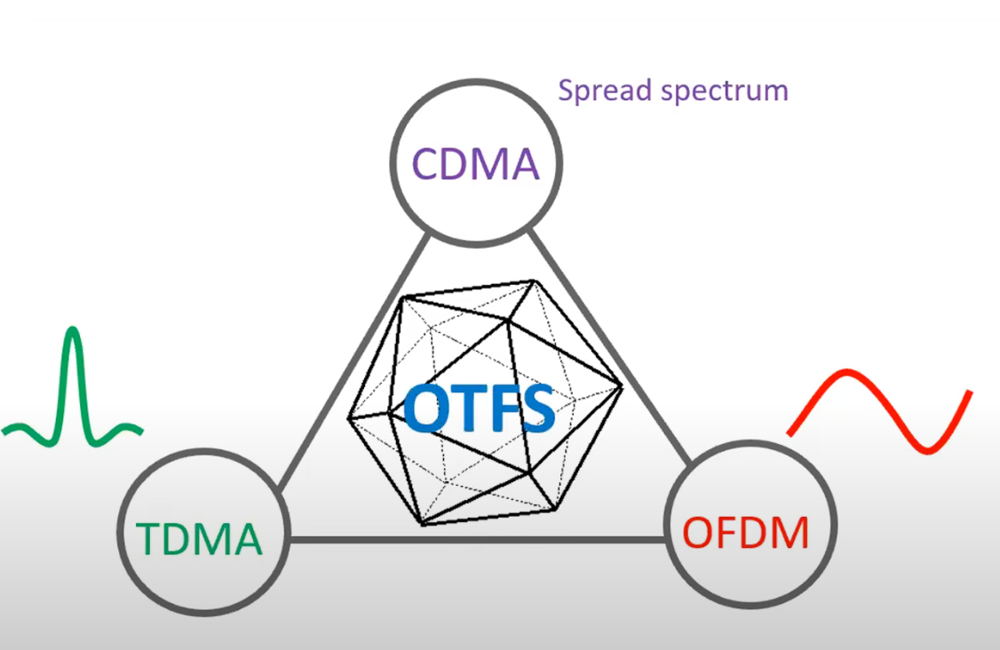

# Evolution of Wireless   

    <figcaption><a href="https://youtu.be/m6FkhFTzCUQ?si=zxJQM0aIlyAVjeoI">Credit: Emanuele Viterbo and Yi Hong.</a></figcaption>

Waveform design is the major change between the generations

## Waveforms

    <figcaption><a href="https://youtu.be/DtXVTIJjlxo?si=yxYE-C9BEnXrZM_f">Credit: Ronny Hadani.</a></figcaption>

CDMA, TDMA and OFDM all descend mathematically from OTFS (OTFS Waveform Carrieer Pulsone)

